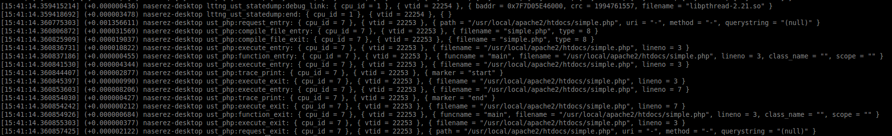

PHP LTTng tracing extension
======
An extension to enable PHP requests tracing using LTTng tracer. You can trace all your php requests and extract runtime information about them. Using the Trace Compass tool you can have graphical views of Call Stack, Flame Graph, Top Requests and other interesting runtime information about your php requests.


## Installation

You can build and install the LTTng extension from source which is straightforward:

      git clone https://github.com/naser/LTTng-php-tracing-module.git
      cd LTTng-php-tracing-module
      phpize
      
      /* Before configuration, make sure you have LTTng 2.X installed in your machine. For installation manual refer to: http://lttng.org/docs/v2.9/#doc-installing-lttng */
      
      ./configure     
      make
      sudo make install
      
Currently it supports PHP 7.x, and  LTTng >= 2.8. To install LTTng 2.9 in Ubuntu you can use these commands:

      apt-add-repository ppa:lttng/stable-2.9
      apt-get update
      apt-get install lttng-tools liblttng-ust-dev
      
       
Also, for the php, make sure you have installed php7.X-dev:

      apt-get install php7.0-dev  

## Enabling the extension

After installation you will need to add `extension=lttng.so` to your primary *php.ini* file. To do so, run php -m in the command line to check if lttng is among the installed php extensions. If it is not there, you should manually enable it. 

      # To see where .ini files are located
      php -i | grep "\.ini"
      
Open the php.ini with an editor , search for 'Exentions' (or 'Dynamic Extensions') within the ini file and add this line there:
      
      extension=lttng.so
      # then save the file
      
Now run the php -m (or php -m | grep lttng) in the command line and this time you should see the lttng in the installed and enabled modules 

      # To see if lttng extension is loaded
      php -m | grep lttng
 
 
 ---

**Note**: You can also enable the extension temporarily using the command line:

```bash
php -d extension=lttng.so
```

## Usage

1- Tracing:

To use this extension, you should first run LTTng and enable the lttng-ust tracing. To run LTTng run the following commands:

      lttng create
      lttng enable-channel ss -u --subbuf-size 8M;
      lttng add-context -u -t vtid -c ss; 
      lttng enable-event -u -a -c ss
      lttng start
      ... run your php code
      lttng stop
      lttng view
 There are two scripts in the folder called trace-start and trace-stop that you can run to do all those above commands: 
 
```bash
./trace-start

run your php script ...

./trace-stop
```

A sample output of what you would get from tracing your script is shown in the following image:



2- Analysis:

To play with the resulting logs, do your analysis using a graphical interface, you can install Trace Compass (http://tracecompass.org/) and import your trace there. 

It is also possible to use python codes to analyse the trace events which will be uploaded here shortly. For the moment, you can use my other project to play with the events and do your analysis: 
https://github.com/naser/lttnganalyses-for-lampstacktraces

      
      
